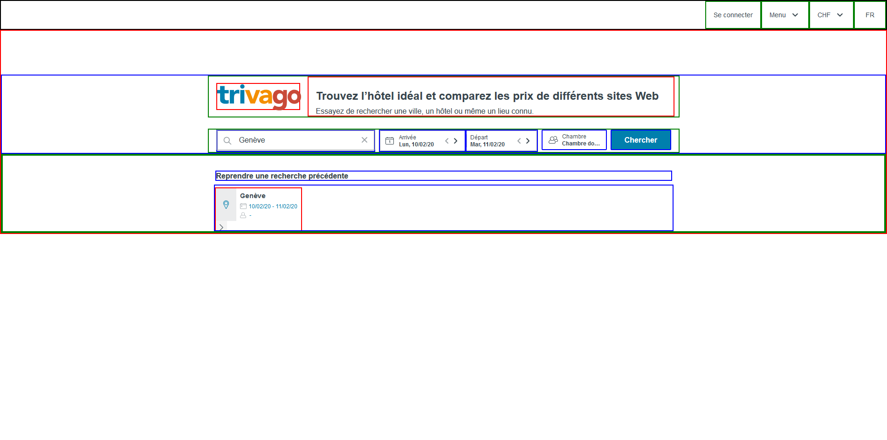
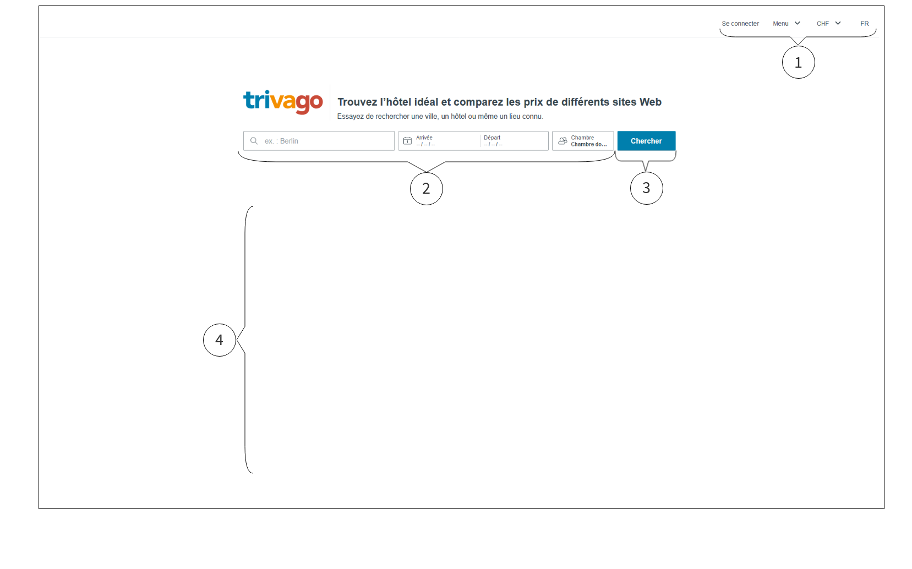
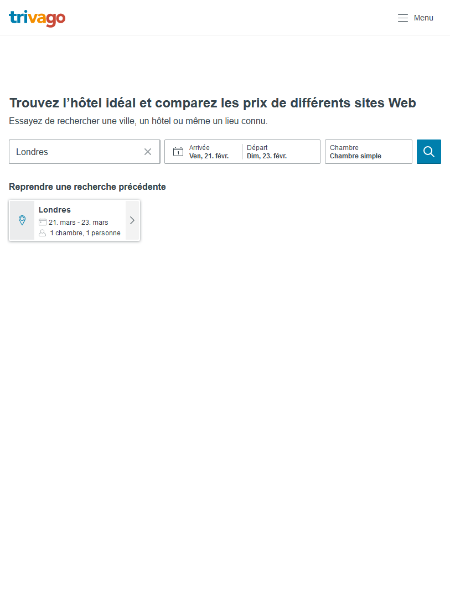
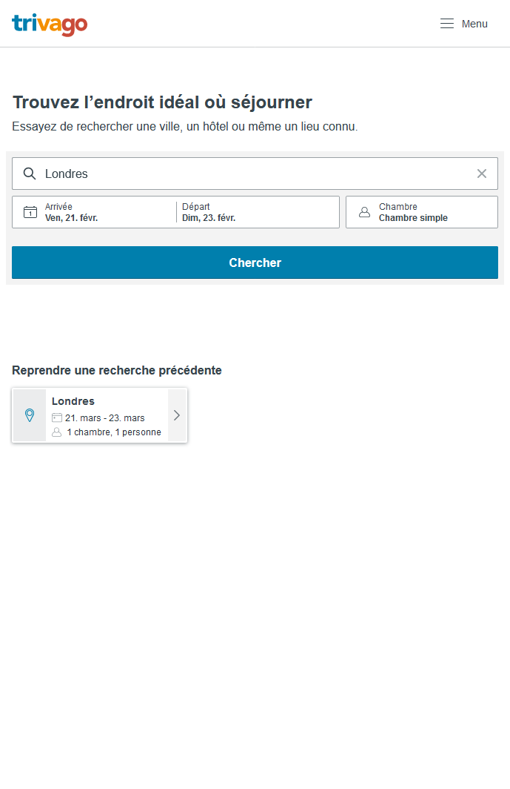

## Analyse graphique du DOM



Le site de conpose comme suit :

```
Elément regoupant tout le contenu
    En-tête de la page (encadré en noir)
        Un logo caché en format desktop sur la gauche
        Les différent éléments du menu (en vert)
    Contenu de la page (en rouge)
        L'en-tête du contenu (en bleu)
            Du texte pour décrire le site (en vert)
                Le logo et le texte de description du site (en rouge)
            Un conteneur des contrôles (en vert)
                Des contrôles pour filtrer des hôtels (en bleu)
        Zone des recherches précédentes (en vert)
            Texte décrivant le contenu du dessous (en bleu)
            Conteneur des recherches précédentes (en bleu)
                Une des recherches précédentes ( en rouge)
```

## Element de la page



1 Header contenant
  - Le bouton de connection
  - Une liste déroulante pour le menu
  - Une liste déroulante pour la séléction de la devise
  - Une liste déroulante pour la séléction de la langue

2 Options de la recherche
  - Un champ texte pour le lieux de l'hôtel
  - Un input type date pour la date d'arrivée à l'hôtel
  - Un input type date pour la date de départ de l'hôtel
  - Une liste déroulante pour la séléction du type de chambre

3 Le bouton pour effectuer une recherche

4 Recherches précédantes, uniquement des images et du texte

## Responsive

Les largeurs mesurées ont été efféctuées sur un écran de 1920px de large et firefox developpeur pour le navigateur

1er changement lorsque la fenêtre arrive à une largeur de 962px  


- Le logo au centre disparait et celui en haut à gauche apparaît
- Le menu en haut à gauche passe en mode compact
- Le bouton de recherche se compacte pour ne laisser que l'icône

2ème changement lorsque la fenêtre arrive à une largeur de 962px  


- Les éléments des options de recherche se séparent sur plusieurs lignes
- Le bouton prend la totalité de la largeur, l'icône disparait pour laisser place à du texte